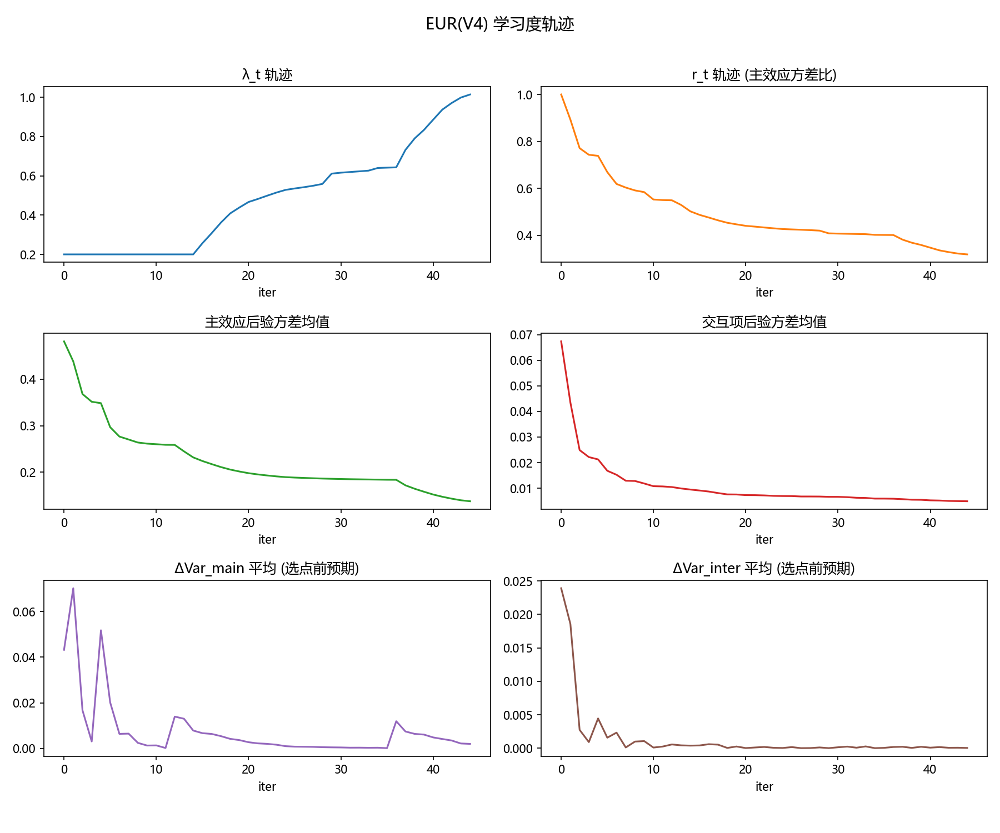
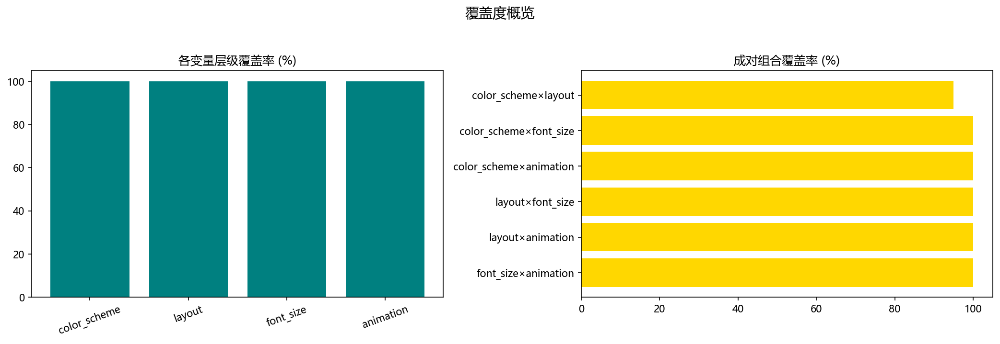
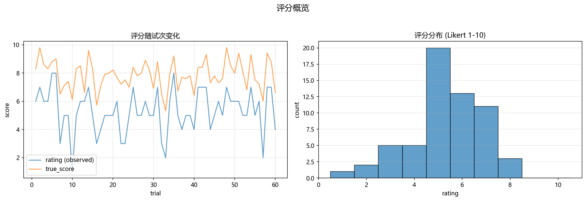

# Pool-based EUR(V4) 报告 (20251030_205145)

## 配置

- 预算: 15 init + 45 opt
- 用户类型: balanced  噪声: 0.5
- γ=0.5  λ∈[0.2, 2.0]  τ1=0.5  τ2=0.1

## 关键指标

- 总试验数: 60  唯一设计: 60  去重率: 100.0%
- 平均评分: 5.317  最高评分: 8.00

### 变量覆盖率

- color_scheme: 100.0% (5/5)
- layout: 100.0% (4/4)
- font_size: 100.0% (6/6)
- animation: 100.0% (3/3)

### 成对组合覆盖率 (Top)

- color_scheme×font_size: 100.0% (30/30)
- color_scheme×animation: 100.0% (15/15)
- layout×font_size: 100.0% (24/24)
- layout×animation: 100.0% (12/12)
- font_size×animation: 100.0% (18/18)
- color_scheme×layout: 95.0% (19/20)

## 可视化

## 评价

- 结构性去重达成 (≈100%)，重复采样已被有效避免。
- 各变量层级覆盖充分，有助于稳健估计主效应。
- 成对交互覆盖充分，二级交互可较为可靠地学习与验证。
- λ_t 随试次上升，表明主效应收敛后逐步加大交互项权重，策略符合预期。
- 主/交互后验方差整体下降，模型逐步收敛，信息增益递减符合学习规律。
